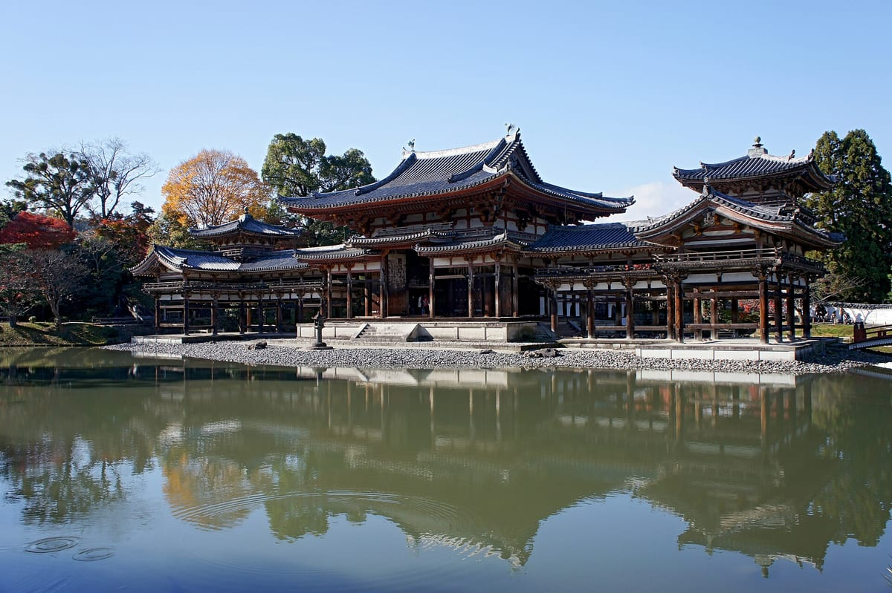

# 宗教の移り変わり

## 仏教の伝来と崇仏論争
<!-- items: jh-religion-buddhism-arrival, jh-religion-sobutsu-dispute -->
日本の宗教の歴史は、もともとあった神々への信仰に、外から伝わった仏教やキリスト教がどう出会い、国や人々がそれをどう扱ってきたか、という物語として読むことができます。

6世紀、朝鮮半島の**百済**の聖明王が、仏像や経典を欽明天皇に贈りました。これが仏教の**公伝**（国から国への公式な伝来）です。年は、**538年**とする説が有力です。『日本書紀』は552年としていますが、そこに載る百済の上表文には、のちの703年に訳されたお経の文句が含まれていて、記事の信頼性が疑われているためです。

百済はこのころ、倭（日本）との同盟のもとで、軍事的な支援を求めていました。大陸の先進的な文化である仏教を伝えることは、その見返りとして結びつきを深め、外交を有利に進める手段でもあったと考えられています。

伝わった仏教を受け入れるかどうかで、豪族たちは対立しました（**崇仏論争**）。蘇我稲目は、西の国々はみな仏を敬っているのだから、日本だけが背くべきではないと受け入れを主張しました。一方、物部尾輿や中臣鎌子は、天皇はこれまで四季ごとに国の多くの神々をまつってきたのだから、外国の神（仏）を拝めば**日本の神々の怒りを招く**と反対しました（『日本書紀』）。仏像を受け入れた直後に疫病がはやると、反対派の進言で、その仏像は捨てられてしまいます。

対立は次の世代に持ち越され、**587年**、蘇我馬子が物部守屋を滅ぼして決着しました（丁未の乱）。仏教に反対する勢力の力は弱まり、仏教は国内に本格的に広まっていきます。

## 国づくりと仏教
<!-- items: jh-religion-seventeen-articles, jh-religion-kokubunji -->
**604年**、役人の心がまえを示した**十七条憲法**が定められました。豪族や役人に向けて、国に仕える者としての道徳を示した決まりです。儒教の考えを中心に、仏教や法家の考えも含んでいます。その第二条は「篤く三宝を敬え」。**三宝**とは、仏教の三つの宝、**仏・法（仏の教え）・僧**のことです。仏教を尊ぶことが、役人の心がまえの一つとされたのです。

十七条憲法は聖徳太子（厩戸王）が作ったとされますが、のちに『日本書紀』がまとめられたときに作られたとする説もあり、議論が続いています。

百数十年後の奈良時代、仏教は国を守る柱になります。**741年**、聖武天皇は、国ごとに**国分寺**と国分尼寺を建てるよう命じました。目的は、仏教の力で国を守り安定させる「**鎮護国家**」です。当時は飢饉や地震、疫病が続き、社会が不安定でした。

都には、全国の国分寺・国分尼寺の中心（総国分寺）として**東大寺**が置かれ、743年に大仏をつくる詔が出されて、752年に大仏の開眼供養が盛大に行われました。東大寺は、現在の**奈良県**にあります。今の大仏のうち、造られた当初の部分は、右脇から腹、脚のあたりと台座の一部だけで、ほかはのちの時代に修復されたものです。

## 平安の新しい仏教と神仏習合
<!-- items: jh-religion-saicho-kukai, jh-religion-honji-suijaku -->
それまでの仏教界は、奈良の都の寺院を拠点とする6つの宗派（**南都六宗**）が中心でした。平安時代の初め、朝廷は、それとは別に新しい仏教界の秩序をつくろうとします。そこで支えられたのが、唐で学んだ2人の僧でした。

**最澄**と**空海**は、同じ804年の遣唐使の一行として唐に渡りました。最澄は帰国後、**天台宗**を開き、比叡山に寺を開きます。この寺はのちに**延暦寺**と呼ばれるようになりました。空海は**真言宗**を開き、**高野山**を賜って拠点とし、都の**東寺**を真言密教の道場としました。空海の密教は、国の安泰を祈る祈祷でも重んじられました。

同じ平安時代、日本の神々と仏をどう関係づけるかという考えもまとまっていきます。仏教が伝わって以来、神と仏の関係は課題でした。神を仏法の守り手とみたり、仏に救われる存在とみたりする段階をへて、**日本の神々は、仏が人々を救うために仮に神の姿で現れたものだ**とする考えにまとまりました。これを**本地垂迹説**といいます。仏の本来の姿を「本地」、仮の現れを「垂迹」と呼び、たとえば天照大神の本地は大日如来とされました。インドや中国でも、仏教はこうして土地の神々を取り込んできました。

このように神と仏を結びつけて信じることを、**神仏習合**といいます。「熊野権現」のように神につける「**権現**」という呼び名は、仏が「権（かり）に現れた」姿という意味です。本地垂迹説とは逆に、神と仏を分けてまつるべきだとする考えが国の方針になるのは、ずっとあとの明治時代のことです。

## 末法と浄土信仰
<!-- items: jh-religion-mappo -->
仏教には、時がたつにつれて仏の教えが衰え、正しく修行しても悟れない「**末法**」の世が来る、という考えがありました。日本では、**1052年**から末法に入るとされました。

ちょうどそのころ、武士が力をつけ、治安も乱れて、世の中の不安が高まっていました。人々は、この世ではなく死後の救いを願うようになります。阿弥陀仏を信じて、死後に極楽浄土へ生まれ変わることを願う**浄土信仰**が、貴族たちの間に広まりました。

藤原頼通は、末法の始まりとされた1052年に、宇治の別荘を寺に改めます。これが**平等院**です。翌1053年には、阿弥陀仏をまつる阿弥陀堂（**鳳凰堂**）が建てられました。池や庭と一体になって、阿弥陀仏のいる西方極楽浄土を思い描けるようにつくられています。

## 鎌倉新仏教
<!-- items: jh-religion-kamakura-buddhism -->
鎌倉時代には、新しい仏教の宗派が次々に生まれました。それまでの仏教（天台宗・真言宗や奈良の寺院など）では、厳しい戒律を守ることや学問、寺への寄進が求められていました。新しい宗派は、それとは違い、**やさしい実践ひとつにひたすら打ち込めば救われる**と説きました。

実践は大きく3つに分かれます。

- **念仏**（「南無阿弥陀仏」と唱える）: **法然**の浄土宗、**親鸞**の浄土真宗、一遍の時宗
- **題目**（「南無妙法蓮華経」と唱える）: **日蓮**の日蓮宗
- **座禅**: **栄西**の臨済宗、**道元**の曹洞宗

地震や飢饉、疫病が続く不安な時代に、こうした教えは、身分を問わず武士や庶民に受け入れられていきました。朝廷が寺を建てさせたり、幕府がほかの宗派を禁じたりしたから広まったのではありません。

ただし、「鎌倉新仏教」を日本仏教の頂点とみる見方は、近代につくられたものです。今では、当時の仏教界の中心はなお天台宗・真言宗などの寺院だったとする学説（顕密体制論）などにより、見直されています。

## 一向一揆
<!-- items: jh-religion-ikko-ikki -->
親鸞の教えを受け継ぐ**浄土真宗（本願寺）**の門徒は、戦国時代には大きな勢力になりました。その門徒たちが起こした一揆を**一向一揆**といいます。

本願寺の**蓮如**が北陸で布教すると、門徒たちは大きくまとまっていきました。**1488年**、戦いの費用の負担などに反発した地元の武士たち（**国人**）が、門徒とともに立ち上がり、**加賀**（現在の**石川県**の南部）の**守護**・**富樫政親**を倒します。守護とは、幕府から国ごとに任じられて国を治めた武士のことです。一揆勢は10万とも20万ともいわれる軍勢でした。

その後およそ90年にわたって、門徒たちが加賀を治めます。この国は「**百姓の持ちたる国**」と呼ばれました。

## キリスト教の伝来
<!-- items: jh-religion-christianity-arrival -->
**1549年**、イエズス会の宣教師**フランシスコ・ザビエル**が**鹿児島**に来て、キリスト教の布教を始めました。ザビエルはその後、平戸（長崎県）や山口、豊後（大分県）などをまわり、1551年まで、約2年間日本に滞在しました。

戦国大名の中には、布教を認めたり、自ら信者になったりする者もいました（**キリシタン大名**）。宣教師は布教の見返りに、ポルトガルなどとの貿易（**南蛮貿易**）や、国内では作れない火薬の原料・**硝石**などの援助を示し、大名もその利益を得ようとしたのです。当時、仏教が禁じられていたわけでも、朝廷がキリスト教を広めるよう命じたわけでもありません。

## 信長と宗教勢力
<!-- items: jh-religion-nobunaga -->
天下統一を進める**織田信長**にとって、武力や経済力を持つ宗教勢力は、大名と並ぶ敵でした。

**1571年**、信長は**比叡山延暦寺**を焼き討ちします。平安時代に最澄が開いた、天台宗の中心寺院です。延暦寺が、信長と敵対する浅井・朝倉氏に味方したことが背景にありました。当時の記録では数千人が殺されたとされますが、近年の発掘調査などから、焼き討ちの前にすでに廃れていた建物も多く、被害は記録ほど大きくなかったのではないかと見直されています。

**1570年から約10年**にわたって、信長は大坂の**本願寺**とも戦い続けました（**石山合戦**）。本願寺を率いる**顕如**は、諸国の門徒に決起を命じ、毛利氏の援助も受けて戦いましたが、1580年に朝廷の仲立ちで講和し、大坂を退去しました。同じ1580年、加賀の門徒の拠点も、信長の家臣・柴田勝家らに攻め落とされています。

## 禁教令と寺請制度
<!-- items: jh-religion-kinkyo, jh-religion-terauke -->
豊臣秀吉は1587年にバテレン追放令を出しましたが、これは主に宣教師の追放を命じたもので、信仰の取り締まりは徹底されませんでした。

政策としての弾圧が始まるのは、江戸幕府の**禁教令**からです。キリシタン大名と幕府の役人の間で起きた賄賂の事件（**岡本大八事件**）をきっかけに、幕府は宣教師の関与を疑い、信者どうしの結びつきを、支配を脅かしかねない勢力として警戒するようになりました。**1612年**、幕府はまず直轄地で、続いて全国でキリスト教を禁じ、教会の破壊や宣教師の追放を進めます。全国への禁教令は「1613年」と書かれることが多いですが、出されたのは慶長18年12月で、西暦では1614年1月にあたります。1637年には、キリスト教徒への弾圧も背景に、島原・天草一揆が起きました。

禁教を徹底するために、幕府は**寺請制度**をつくります。人々は必ずどこかの寺の信徒（**檀家**）となり、寺がその人はキリシタンではないと証明しました。1638年には、全国の寺に証明書（**寺請証文**）をつくらせています。対象は、キリスト教と、幕府が禁じた日蓮宗の不受不施派でした。

寺がつくる帳簿（**宗門人別改帳**）は、今の戸籍のように人々を把握する役割も果たし、引っ越すときには寺請証文が身分証明として必要でした。ただし、これは目的ではなく、禁教のための仕組みから生まれた結果です。寺の収入を増やすためや、年貢を集めるためにつくられた制度ではありません。

## 江戸の庶民と伊勢参り
<!-- items: jh-religion-ise -->
寺請制度で寺と結びつけられた一方で、江戸時代の庶民は、神社への参詣も盛んに行いました。なかでも人気を集めたのが、**伊勢神宮**（現在の**三重県**）への**伊勢参り**です。

遠く離れた伊勢へ行けたのには、理由がありました。村などの仲間で旅費を積み立て、くじで選ばれた代表が参詣する仕組み（**伊勢講**）があり、各地をまわって講をつくり、参詣者の宿や案内を世話する**御師**の活動もありました。伊勢参りを目的とする旅は、通行手形も得やすかったとされます。鉄道はまだなく、幕府が参詣を命じたわけでもありません。

1705年、1771年、1830年などには、数百万人が一度に押し寄せる「**おかげ参り**」が起き、1830年には400万人をこえる人々が参詣したとされます。奉公人や子どもが主人や親に黙って出かける「抜け参り」も、参詣した証拠の品を持ち帰ればとがめられませんでした。

## 近代の宗教と国家
<!-- items: jh-religion-shinbutsu-bunri, jh-religion-freedom, jh-religion-shinto-directive -->
明治時代になると、国と宗教の関係は大きく変わります。

**1868年**、明治政府は**神仏分離令**を出しました。それまでは神と仏を一緒にまつる神仏習合が長く続き、神社に僧が仕えたり、仏像を御神体としたりすることもありました。政府は、天皇を中心に神をまつる政治（祭政一致）を目指し、神道を国の中心に据えるため、神と仏を分けさせたのです。**仏教そのものを排斥する目的ではありませんでした。**

ところが実際には、仏教に圧迫されてきたと考える神職や民衆などによって、各地で仏像や寺を壊す**廃仏毀釈**が起きます。政府の意図を超えて広がったため、政府は「神仏分離は廃仏毀釈を意味しない」と改めて注意しました。奈良の興福寺では、五重塔までもが資材として25円で処分の対象にされたと伝えられます。寺が人々を管理する立場になった江戸時代への反感が、その背景の一つになったともいわれます。

**1889年**の大日本帝国憲法は、第28条で信教の自由を認めました。ただしそれは、「**安寧秩序を妨げず、臣民としての義務に背かない限り**」という条件つきで、法律によらず命令でも制限できると理解されていました。また、神社は「宗教ではない」として、仏教やキリスト教とは別に、国から特別な扱いを受けました。

第二次世界大戦後の**1945年12月**、連合国軍の**GHQ**は**神道指令**を出しました。国家と結びついた神社神道（**国家神道**）が軍国主義・超国家主義の源になったとみて、信教の自由を確立し、軍国主義を取り除くため、国家と神社神道を切り離したのです。神社への公的な支援は禁じられ、神祇院は廃止され、公文書で「大東亜戦争」や「八紘一宇」といった言葉を使うことも禁じられました。

その考え方は、1946年に公布された**日本国憲法**に引き継がれます。第20条は、条件をつけずに信教の自由を保障し、どの宗教団体も国から特権を受けたり政治上の権力を使ったりしてはならず、国も宗教的な活動をしてはならないと定めました。国と宗教を切り離すこの原則を、**政教分離**といいます。第89条では、宗教団体への公金の支出も禁じられました。

仏教の受け入れをめぐる争いから、国を守る仏教、個人の救いを求める仏教、神と仏の結びつき、キリスト教の伝来と禁教、そして国と宗教の分離へ。日本の宗教の移り変わりは、そのまま国のあり方の移り変わりでもありました。
