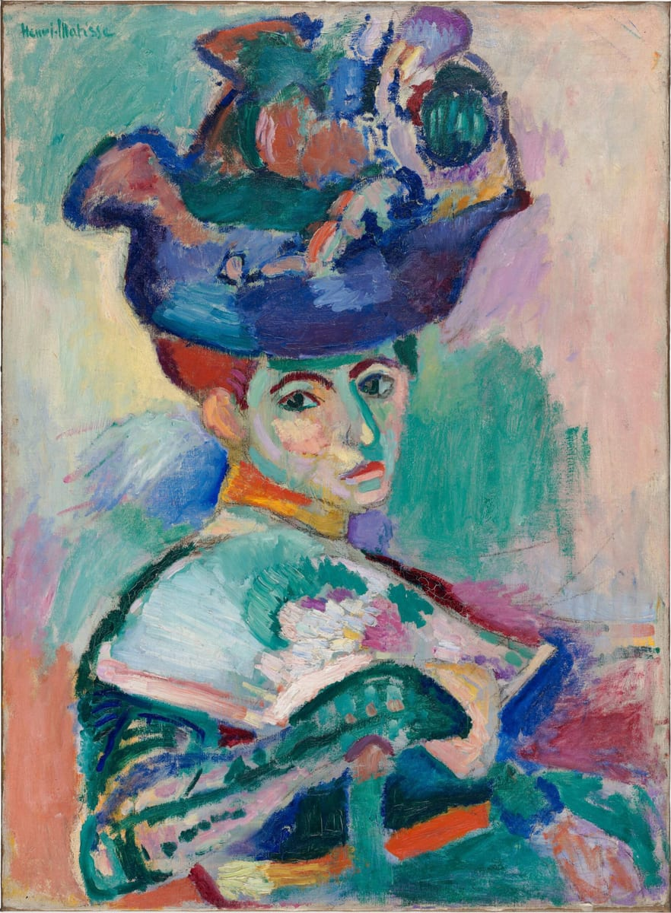
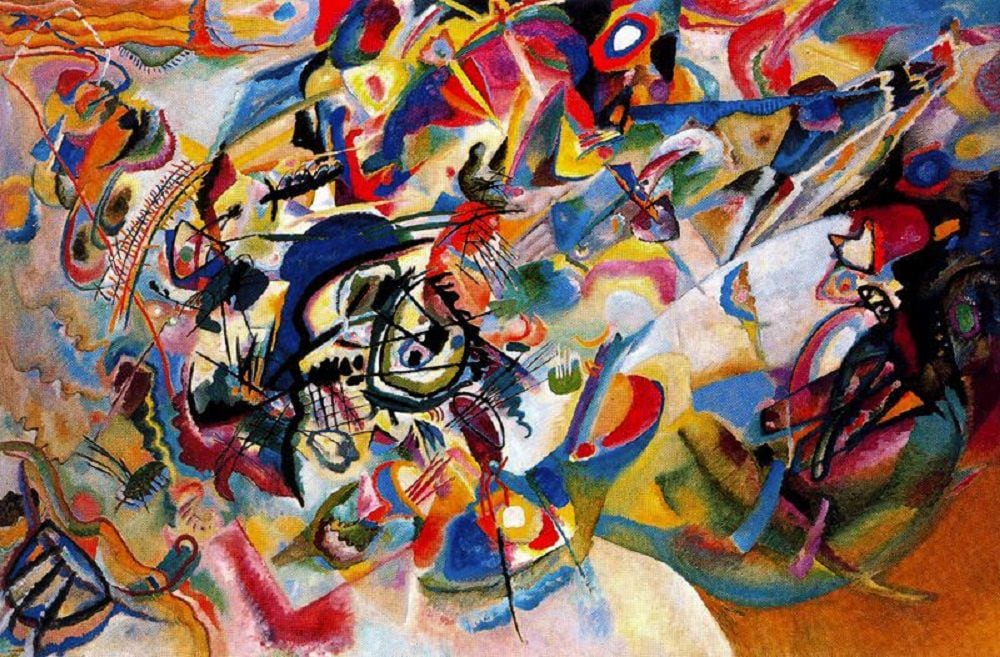
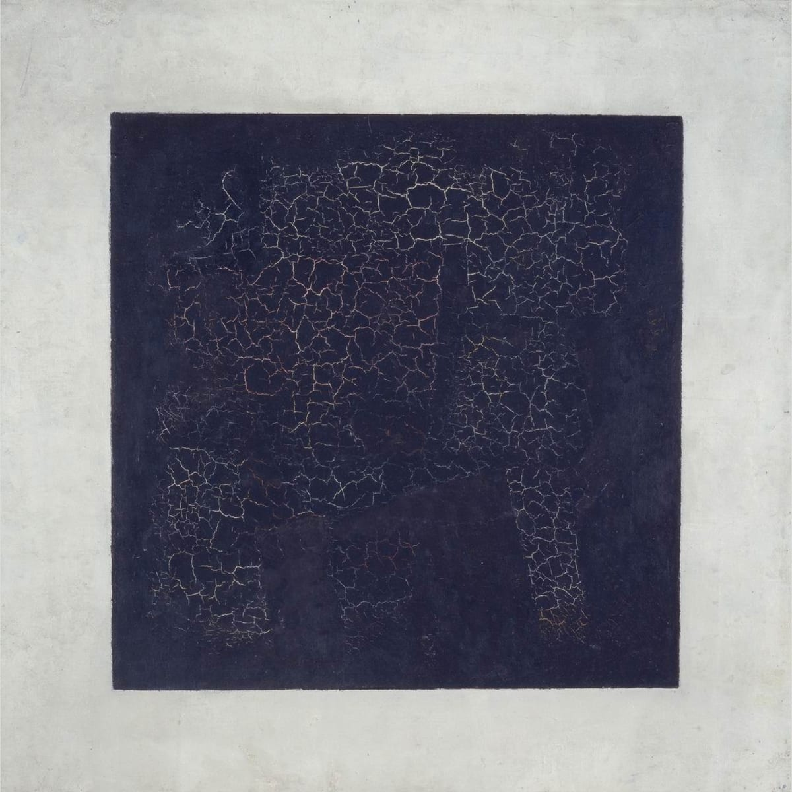
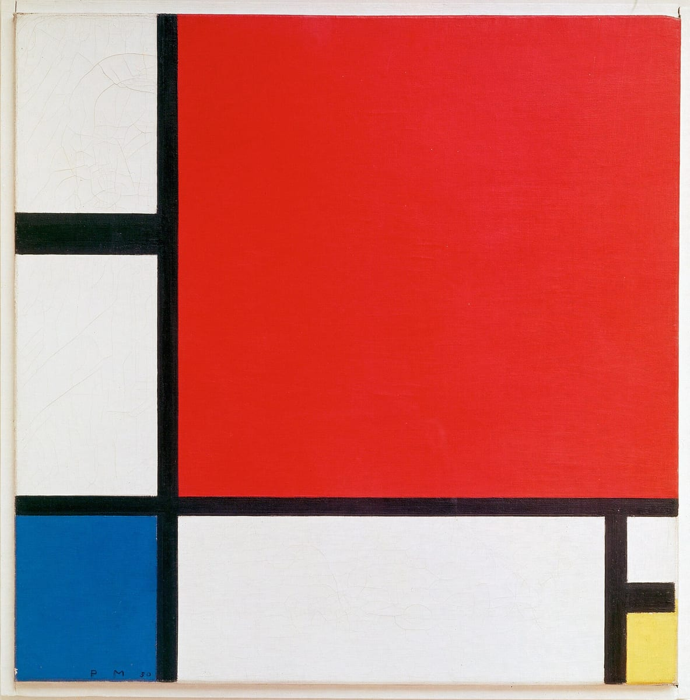

# 20世紀前半の革新

## フォーヴィスム：色を解き放つ
<!-- items: pt-abstract-fauvism -->
19世紀の後半、絵画は少しずつ「見たまま」から離れ始めていました。1874年に**第1回印象派展**を開いたモネたち**印象派**は、アトリエを出て**戸外で**描き、**筆のタッチを残したまま色を重ねて**、移り変わる**光の一瞬**を捉えようとしました。そのあとのセザンヌは、光よりも物の形を確かに組み立てることを求め、ゴッホやゴーギャンは、色や線の力で内面を表そうとしました。

20世紀に入ると、この流れは一気に進みます。最初に解き放たれたのは、**色**でした。

1905年、パリの展覧会**サロン・ドートンヌ**で、ある展示室が大きな騒ぎになります。**マティス**や**ドラン**、**ヴラマンク**らの、原色を多用した強烈な色と激しいタッチの絵が集められていたのです。これを見た批評家ヴォークセルは、展示室を「**野獣（フォーヴ）の檻**」にたとえました。ここから、彼らの絵は**フォーヴィスム（野獣派）**と呼ばれるようになります。

このときマティスが出品した一枚が、妻アメリーを描いた《**帽子の女**》（1905年）です。大きな帽子をかぶった女性の顔や服に、緑や紫など、見たままとは違う強い色が、荒々しい筆づかいで塗られています。見た人の多くは「幼稚だ」「正気ではない」と酷評しました。

それまで絵の色は、物の本当の色を再現するためのものでした。フォーヴィスムの画家たちは、**色を、自分の感覚を表す道具として自由に使いました**。木の幹を赤く塗るように、物の本当の色にとらわれず、原色を大胆に置いていったのです。明るく強い色で内面を表したゴッホやゴーギャンの試みを、さらに押し進めたものといえます。

## キュビスム：形を組み立て直す
<!-- items: pt-abstract-cubism -->
フォーヴィスムが色を解き放ったのとほぼ同じころ、今度は**形**を解き放つ動きが始まりました。

1907年の秋、スペイン出身の画家**ピカソ**は、パリで《**アビニヨンの娘たち**》を描き上げました。裸の女性たちの体や顔が、角ばった面に分けられて描かれたこの絵は、発表された当初は否定的に受け止められました。しかしのちに、これが**キュビスム**の出発点とされます。

翌1908年、フランスの画家**ブラック**も、物を幾何学的な形で描いた風景画を発表します。その年の秋、ブラックの絵を見た批評家ヴォークセルは、「ブラックは一切を**立方体（キューブ）**に還元する」と書きました。これがキュビスムという名の起こりとされます。フォーヴィスムの名づけ親と同じ批評家でした。

キュビスムの土台になったのは、**セザンヌ**の考えです。セザンヌは、自然を**円筒・球・円錐**として捉えようと語り、一枚の静物画の中に、上から見た形と横から見た形を混ぜて描いていました。

ピカソとブラックは、この考えをさらに押し進めます。それまでの絵は、**1つの視点**から見た姿を、遠近法で本物らしく描くものでした。キュビスムは、物を**幾何学的な面に分解**し、**複数の視点から捉えた形を、1枚の画面に組み立て直しました**。1つの物を、前からも横からも見たように同時に描いたのです。

2人の共同の探究は、1914年、ブラックが第一次世界大戦で兵士として召集されるまで続きました。

## カンディンスキー：物を描かない絵
<!-- items: pt-abstract-kandinsky -->
フォーヴィスムは色を、キュビスムは形を、見たままから解き放ちました。それでも、どちらの絵にも、人や風景、静物といった「何か」が描かれていました。では、物をまったく描かない絵はありうるのでしょうか。

その一歩を踏み出したのが、ロシア出身の画家**カンディンスキー**です。モスクワの大学で法律を学んだのち、画家をめざしてドイツのミュンヘンに移った彼は、**1910年ごろ**から、物の形を描かない**抽象絵画**を手がけ始めました。フォーヴィスム（1905年）やキュビスム（1907年）の数年後、第一次世界大戦（1914年）の少し前のことです。

カンディンスキーが手本にしたのは、**音楽**でした。音楽は、何かの姿を写さなくても、音の組み合わせだけで人の心を動かします。同じように絵画も、物を描かず、**色と形だけで見る人の心に働きかけられる**と考えたのです。作品には「**コンポジション**（作曲）」「**インプロヴィゼーション**（即興）」という、音楽の言葉を題につけました。

《コンポジションVII》（1913年）では、物の形は描かれず、色とりどりの形や線が、画面いっぱいに渦巻くように重なり合っています。

1911年には、画家フランツ・マルクとともに「**青騎士**」というグループを結成し、新しい芸術を広めようとしました。

## マレーヴィチ：黒の正方形
<!-- items: pt-abstract-malevich -->
抽象絵画を、さらに極端なところまで推し進めた画家がいます。ロシアの**マレーヴィチ**です。

1915年、マレーヴィチはペトログラード（現在のサンクトペテルブルク）で開かれた「0,10」展に、《**黒の正方形**》を出品しました。白い地の中央に、**黒い正方形がひとつだけ**描かれた絵です。

この絵には、人も風景も、何ひとつ描かれていません。マレーヴィチは、自然の物を描くことをやめ、**色や形そのものによる純粋な感覚**を表そうとしたのです。この考えを、彼は**シュプレマティスム**と呼びました。

展覧会では、この絵は部屋の隅の、天井に近い高い位置に掛けられました。そこは、ロシアの家庭で聖像画（イコン）を飾る場所です。

1874年の第1回印象派展から、1905年のフォーヴィスム、1907年のキュビスムを経て、1915年の《黒の正方形》まで。光、色、形と、見たままから一つずつ離れていった絵画は、40年ほどで、ついに物を何も描かない絵にたどり着いたのです。

## モンドリアン：線と三原色
<!-- items: pt-abstract-mondrian -->
オランダの画家**モンドリアン**は、はじめ風景や樹木を描いていました。1911年、アムステルダムの展覧会でキュビスムの作品に出会って深く感銘を受け、翌年パリへ移ります。

しかしモンドリアンは、キュビスムの抽象化はまだ徹底していないと考えました。**宇宙の調和**や純粋なリアリティを表すには、**完全に抽象的な芸術**が必要だと考えたのです。1917年には、同じ考えを持つ仲間とともに雑誌『**デ・ステイル**』を創刊しました。

やがてモンドリアンは、画面を**水平と垂直の直線**だけで分け、**赤・青・黄の三原色**と白・黒などだけを使って描くようになります。《赤・青・黄のコンポジション》（1930年）では、黒い線で区切られた画面に、大きな赤の四角と、小さな青と黄の四角が置かれています。

第二次世界大戦の戦火が広がると、モンドリアンは1938年にロンドンへ、1940年にはニューヨークへ移り住みました。そこでジャズの一種**ブギウギ**に触発され、《**ブロードウェイ・ブギウギ**》（1942〜43年）を描いています。1944年、モンドリアンはニューヨークで亡くなりました。

20世紀前半にヨーロッパで生まれた抽象絵画は、こうして大西洋を渡っていきます。戦後、抽象絵画の中心は、アメリカのニューヨークへ移っていくのです。
