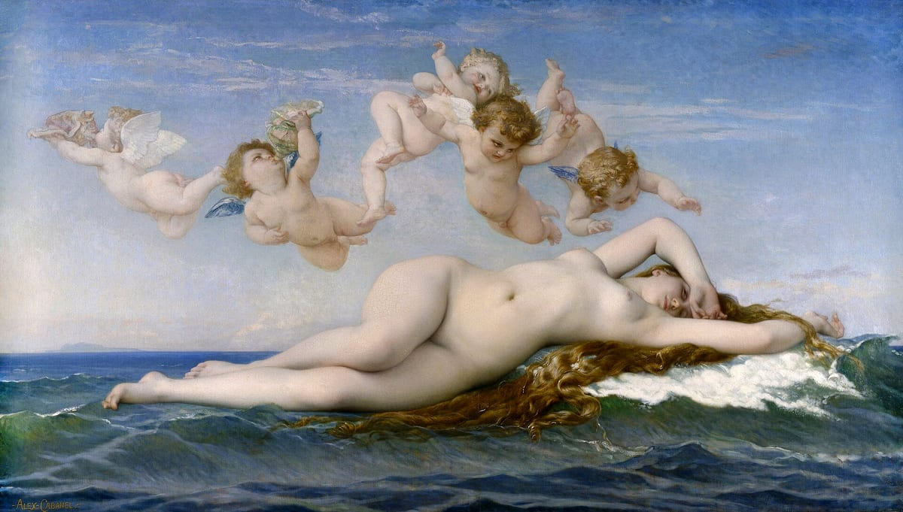
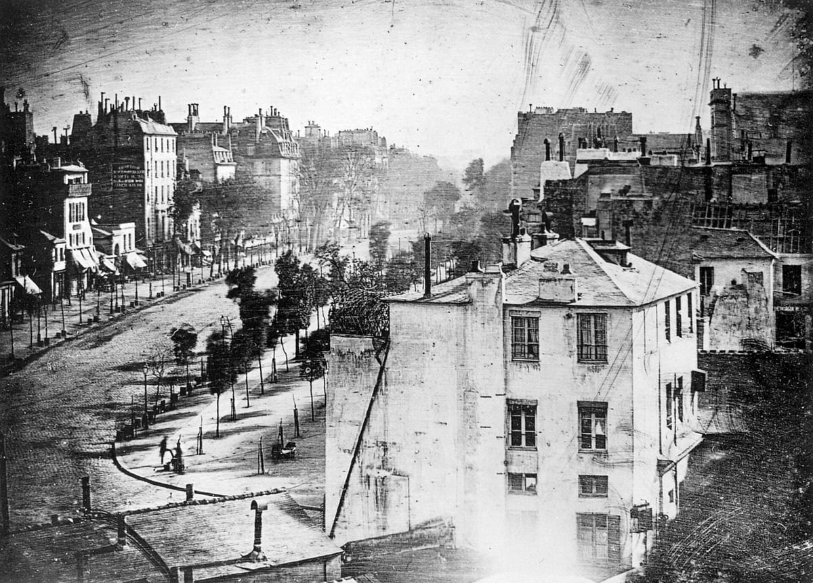
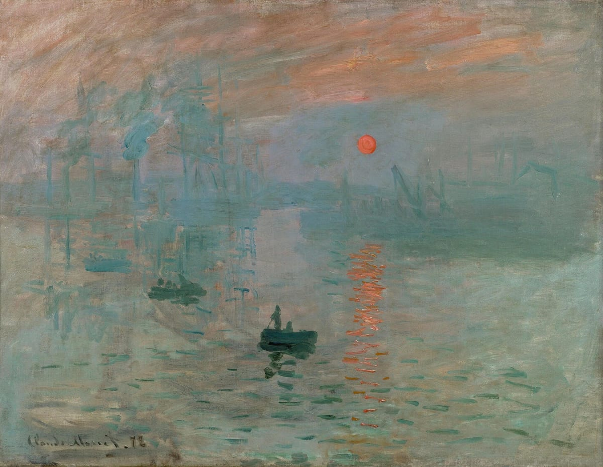
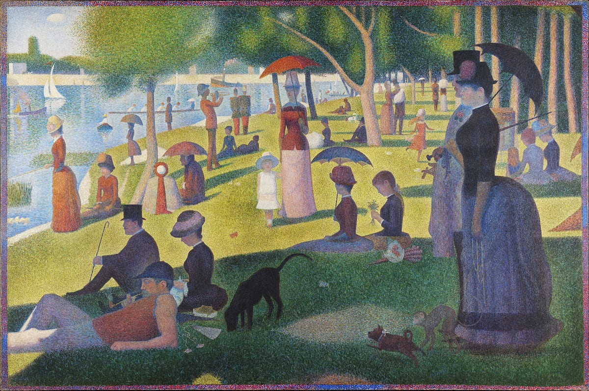
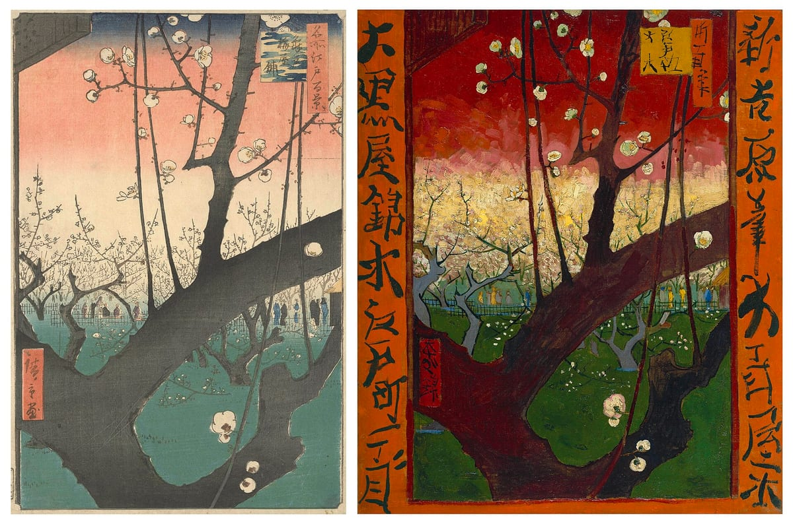
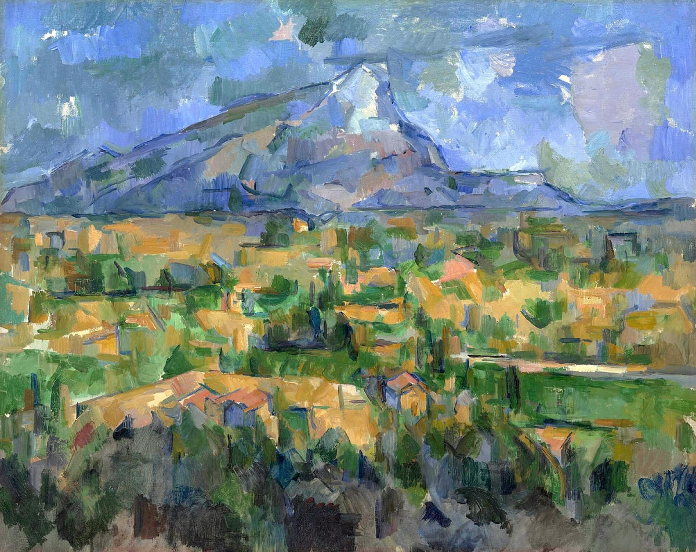
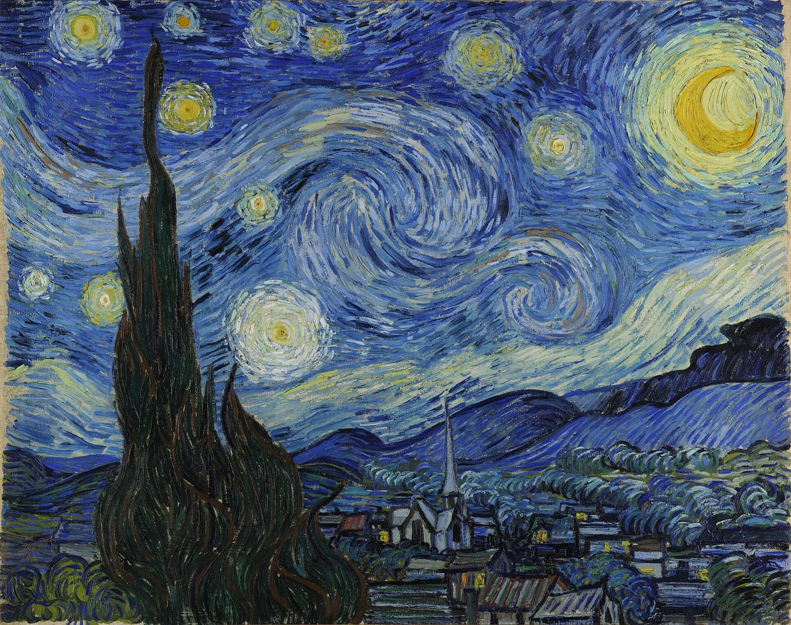

# 印象派とその後

## サロンが決めていた「正しい絵」
<!-- items: pt-abstract-academy -->
19世紀のフランスで画家として認められるには、美術アカデミーが開く公式の展覧会、**サロン**で入選することが、主な道でした。サロンの審査は、アカデミーの考え方、いわゆる**アカデミズム**に沿って行われました。

画家を育てる仕組みも、アカデミーと結びついていました。パリの国立美術学校（**エコール・デ・ボザール**）は、17世紀にアカデミーの付属学校として生まれた学校です。優秀な学生には**ローマ賞**が与えられ、ローマで古代ギリシア・ローマの美術を学ぶための奨学金が出ました。古代の古典を手本にすることが、画家の正しい道とされていたのです。

アカデミーは、絵の主題にも格の上下をつけていました。最も格が高いのは、神話や歴史の場面を描く**歴史画**です。宗教画や肖像画も重んじられた一方、風景画や静物画は軽く見られていました。描き方も、筆の跡を見せずになめらかに仕上げ、本物らしく描くことが求められました。カバネルの《ヴィーナスの誕生》（1863年）は、そうした絵の代表です。波の上に横たわる女神を、つややかな肌で、どこにも筆の跡が見えないほどなめらかに描いています。

審査が保守的だったため、新しい描き方を試す若い画家は落選を重ねました。1863年は特に審査が厳しく、落選者があまりに多かったため、皇帝ナポレオン3世の命令で「**落選展**」が開かれます。そこに出品されたマネの《草上の昼食》は大きな騒ぎを起こしました。

マネは2年後の1865年、サロンに《オランピア》を出品し、再び激しい非難を浴びます。構図は、ルネサンスの画家ティツィアーノの《ウルビーノのヴィーナス》を借りていました。ところが描かれていたのは、神話の女神ではなく、当時のパリの現実の女性でした。しかも、奥行きや立体感をつける陰影をあえて減らした、平らな描き方です。理想化された美しさを求めるサロンの基準に、正面から挑んだ作品でした。

サロンの外では、別の流れも生まれていました。1830年ごろから、パリ近郊のバルビゾン村に集まった**バルビゾン派**の画家たち（コロー、ミレー、テオドール・ルソーら）が、戸外で自然をよく観察し、風景や農民の暮らしを写実的に描いていました。格の低いとされた風景画に、真剣に取り組んだのです。

## 写真が突きつけた問い
<!-- items: pt-abstract-photography -->
サロンの外でも、絵画の足元を揺るがす発明がありました。1839年、フランスのダゲールが、世界で初めての実用的な写真の方法、**ダゲレオタイプ**を発表したのです。

それまで、目の前の人や景色を正確に残すことは、画家にしかできない仕事でした。写真がそれを機械で行えるようになると、見たとおりに描く技術の価値は下がっていきます。

では、絵にしかできないことは何なのか。この問いは、写真の登場がきっかけのすべてではないものの、印象派をはじめとする新しい絵画が生まれる背景の一つになったと考えられています。

一方で、写真から新しい見方を学んだ画家もいました。のちに印象派の展覧会に参加するドガは、写真に強い関心を持っていました。踊り子たちの楽屋や稽古場を描いた彼の作品には、人物のふとした動作をとらえ、画面の端で人物を大胆に切り取るような、スナップ写真を思わせる構図が見られます。こうした構図には、あとで見る浮世絵の影響も指摘されています。

## 印象派の誕生
<!-- items: pt-abstract-impressionism -->
サロンで落選を重ねたモネやルノワールらは、1874年、サロンとは別に自分たちの展覧会を開きました。のちに**第1回印象派展**と呼ばれる展覧会です。セザンヌやモリゾも作品を出しています。

そこに出品されたモネの《印象・日の出》を見た批評家ルイ・ルロワは、新聞記事で展覧会を皮肉り、「印象」という言葉を使いました。この皮肉が広まり、彼らは**印象派**と呼ばれるようになります。

印象派の画家たちがめざしたのは、**移り変わる光や空気の一瞬**を捉えることでした。アトリエではなく戸外で描き、細部を仕上げるより、筆のタッチを残したまま、前に塗った色が乾かないうちに次の色を重ねていきます。チューブ入りの絵具が出回ったことも、戸外での制作を後押ししました。サロンが求めたなめらかな仕上げとは、正反対の描き方だったのです。

同じ「印象派」でも、画家ごとに関心は違いました。

- **モネ**は、光そのものを追い続けました。1877年にはサン＝ラザール駅を、時刻や視点を変えて何枚も描き、1890年代には積みわら、ポプラ並木、ルーアン大聖堂を、それぞれ時間や天候の違う光で描き分ける**連作**に取り組みます。晩年は、ジヴェルニーの自宅の池に浮かぶ睡蓮を、繰り返し描きました。
- **ルノワール**は、パリの人々の暮らしや余暇を描きました。《ムーラン・ド・ラ・ギャレットの舞踏会》（1876年）では、モンマルトルの舞踏場に集う人々を描いています。人物の肌に落ちる影を、紫や緑で表したことも、それまでの絵にはない試みでした。
- **ドガ**は、戸外よりも室内を好み、バレエの踊り子や競馬など、都市の生活を描きました。
- **モリゾ**は、第1回展から参加した女性画家です。家族や母と子の穏やかな情景を、自然の緑を基調に描きました。

印象派の絵は、はじめはなかなか売れませんでした。その彼らを支えたのが、画商デュラン＝リュエルです。無名だったモネやルノワール、ピサロ、ドガらの作品を積極的に買い、画廊を展覧会の会場に提供し、やがてニューヨークでも大きな展覧会を開いて、アメリカで印象派の人気を高めました。印象派展は、1874年から1886年までに8回開かれました。

## スーラと点描
<!-- items: pt-impressionism-seurat -->
最後の印象派展となった1886年の第8回展で、若い画家スーラの大作が注目を集めました。《**グランド・ジャット島の日曜日の午後**》です。

セーヌ川の中州で休日を過ごす人々を描いたこの絵は、近くで見ると、無数の**小さな色の点**でできています。

スーラは、印象派が色を混ぜずにタッチを並べた描き方を、さらに理論的に押し進めました。パレットの上で絵具を混ぜるのではなく、純粋な色の点を並べ、特に反対の色（補色）どうしを近くに置くことで、見る人の目の中で色が混ざり合い、よりいきいきとした光が生まれると考えたのです。この技法を**点描**と呼びます。

移ろう光の一瞬を感覚でとらえた印象派に対し、スーラは光と色を、科学的な理論にもとづいて組み立て直そうとしました。批評家フェネオンは、こうした画家たちを「**新印象派**」と呼びました。スーラの技法は、画家シニャックによって理論としてまとめられていきます。

## 浮世絵との出会い
<!-- items: pt-abstract-japonisme -->
同じころ、ヨーロッパでは日本の美術が流行していました。19世紀中ごろの万国博覧会への出品などをきっかけに、日本の美術品がヨーロッパに流れ込んだのです。この流行を**ジャポニスム**と呼びます。浮世絵は、輸入品を包む紙として海を渡ることもありました。

画家たちが驚いたのは、浮世絵の描き方でした。立体感をほとんど描かず、**平らな色面**と**はっきりした輪郭線**で形を表し、手前のものを大きく切り取る**大胆で左右非対称な構図**や、上から見下ろす視点を使っています。陰影と遠近法で本物らしく描く西洋の絵とは、まったく違う見方でした。

モネは、妻カミーユに日本の着物を着せ、扇やうちわに囲まれた姿を《ラ・ジャポネーズ》（1876年）に描きました。ドガは葛飾北斎の影響を強く受けたといわれ、『北斎漫画』の人物の構図を自分の作品に取り入れています。マネの《オランピア》の平らな描き方にも、浮世絵の影響が指摘されています。

なかでも熱心だったのがゴッホです。浮世絵を買い集め、1887年には、歌川広重の《名所江戸百景 亀戸梅屋舗》を油絵で模写しています。手前に梅の太い枝を大きく置く大胆な構図を、そのまま取り入れました。

## セザンヌ：光から形へ
<!-- items: pt-abstract-cezanne -->
はじめ印象派の画家たちとともに活動していたセザンヌは、やがて仲間とは違う道を歩み始めます。移ろう光の印象を描くだけでは、物の確かな存在感が失われてしまう、と考えたのです。

セザンヌは、色の面を積み重ねるようにして、形や量感をしっかり組み立てる描き方を追求しました。故郷エクスの近くにあるサント＝ヴィクトワール山を、数十点も描いています。

1904年には、画家エミール・ベルナールへの手紙に「**自然を円筒、球、円錐によって扱う**」と書きました。

セザンヌが好んだ題材の一つが、**リンゴ**などの静物です。時間をかけすぎて、描いているうちにリンゴが腐ってしまったという話も伝わっています。1880年代の静物画をよく見ると、砂糖壺は上からのぞき込んだように、果物かごは横から見たように描かれ、**一枚の絵の中に複数の視点が混ざって**います。見た目の正確さより、画面の中での形の組み立てを優先したのです。

見たものを単純な形の組み立てとして捉え直し、複数の視点を一枚にまとめるこの考えは、のちのピカソたちのキュビスムの土台になります。セザンヌが「**近代絵画の父**」と呼ばれるのは、そのためです。

## ゴッホとゴーギャン：色で内面を描く
<!-- items: pt-abstract-gogh-gauguin -->
印象派のあとに現れたゴッホとゴーギャンは、別の方向へ進みました。見たままの色を写すことよりも、**色や線そのものの力で、内面や感情、象徴的な意味を表そう**としたのです。

ゴッホが画家になる決意をしたのは、1880年、27歳のときでした。それから1890年に亡くなるまでの**約10年間**に、油絵だけで約860点を残しています。生活を支えたのは弟のテオで、兄弟の間で交わされた多くの手紙は、のちに書簡集として出版され、ゴッホの考えを今に伝えています。生前に売れた絵は1枚だけだったともいわれます。

ゴッホは大胆な色とうねるような筆のタッチで、自分の情熱を画面にぶつけました。《星月夜》（1889年）では、渦を巻くような夜空と炎のような糸杉を、見たまま以上に激しく描いています。

ゴーギャンは、平らな色面としっかりした輪郭線で、象徴的な世界を描きました。1888年、2人は南フランスのアルルで共同生活をしますが、関係は2か月ほどで行き詰まり、その直後にゴッホは自分の耳を切る事件を起こします。その後ゴーギャンは南太平洋の**タヒチ**に渡り、《我々はどこから来たのか　我々は何者か　我々はどこへ行くのか》（1897〜98年）のような、人間の生と死を問う大作を描きました。

セザンヌ、ゴッホ、ゴーギャンらは、のちに「**ポスト印象派**」と呼ばれます。印象派から出発しながら、それぞれのやり方で印象派を乗り越えようとした画家たちです。形の組み立てを求めたセザンヌ、色で内面を描いたゴッホとゴーギャン、光を理論で組み立て直したスーラ。見たままから離れていく彼らの試みは、20世紀の絵画へとつながっていきます。
