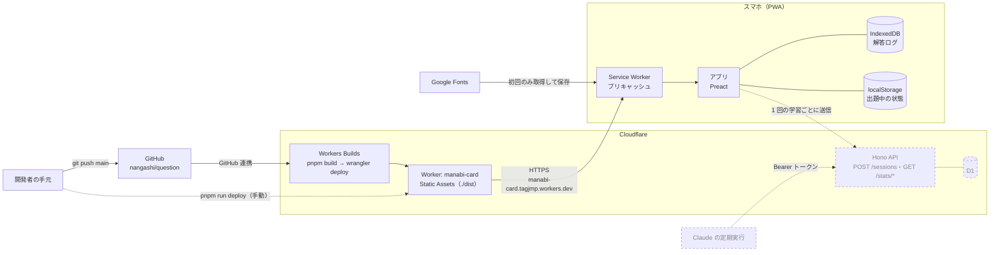
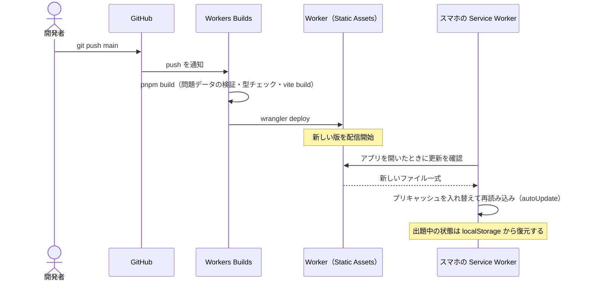

# アーキテクチャ

いまの構成を図で示す。決定の理由は各 ADR に書き、この文書には「いまどうなっているか」だけを書く。構成を変えたらこの文書も更新する。

図の点線は、ADR で採用済みだがまだ実装していない部分（Phase 2 以降）。

## 構成図

| 部分 | いまの状態 | 設定・実装 | 関連 ADR |
|---|---|---|---|
| 静的配信 | 実装済み。JS・CSS・問題データ・画像をすべて `dist/` に含めて配信する | `wrangler.jsonc` | [0005](adr/0005-cloudflare-workers-d1.md), [0012](adr/0012-pwa-and-deploy.md) |
| デプロイ | 実装済み。`main` への push で Workers Builds が動く。手元からの `pnpm run deploy` も使える | Cloudflare の画面の GitHub 連携、`package.json` の `build`・`deploy` | [0012](adr/0012-pwa-and-deploy.md) |
| PWA | 実装済み。ビルドしたファイルをすべてプリキャッシュし、オフラインでも使える | `vite.config.ts` | [0012](adr/0012-pwa-and-deploy.md) |
| 端末内の保存 | 実装済み。解答ログは IndexedDB、出題中の状態は localStorage | `src/` | [0003](adr/0003-local-first-review-log.md) |
| API と D1 | 未実装（Phase 2） | — | [0005](adr/0005-cloudflare-workers-d1.md) |
| Claude 連携 | 未実装（Phase 2） | — | [0006](adr/0006-learning-stats-for-claude.md) |

## デプロイと更新の流れ

- 更新は「次に開いたとき」に反映される。開いたままの画面は古い版のまま（ADR-0012 のリスク）
- `pnpm build` の途中（問題データの検証・型チェック）で失敗すると、デプロイされず前の版のまま残る
